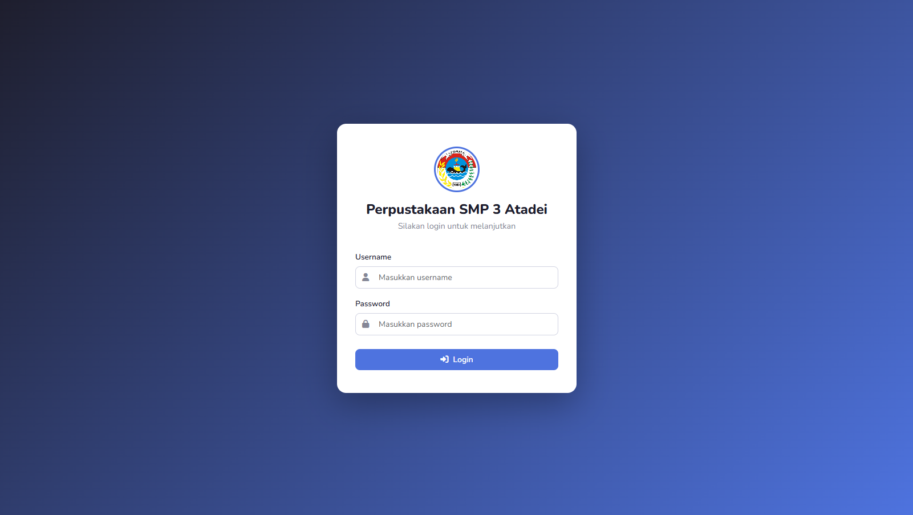
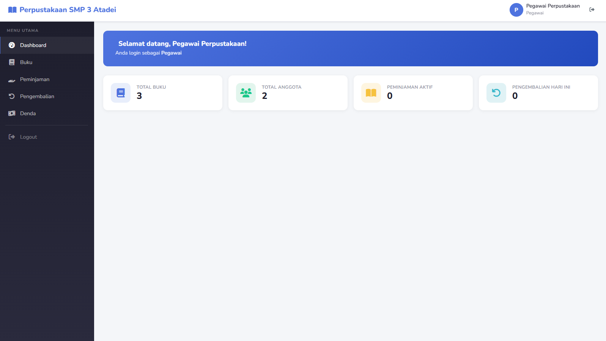
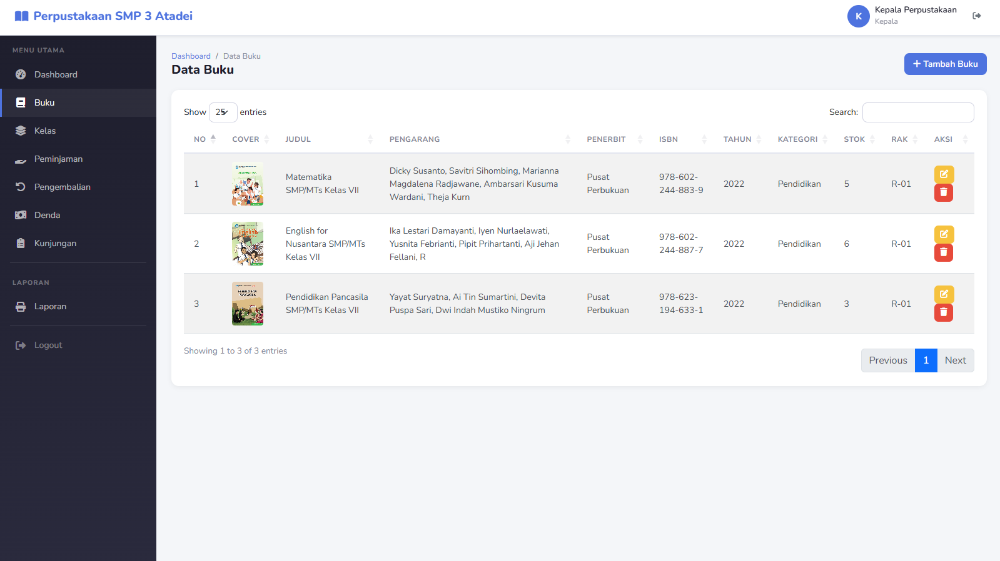
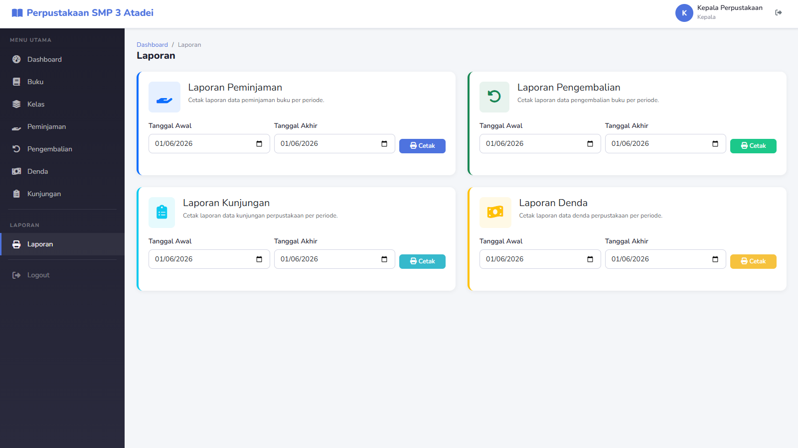

# Library Management System

A web-based library management system built with PHP Native, MySQL, and Bootstrap 5 using MVC architecture. Designed for school libraries to manage books, members, borrowing, returns, fines, and visit records.

## Features

- **Multi-Role Authentication** — Admin, Kepala (Head), Pegawai (Staff), Anggota (Member)
- **Dashboard** — Role-based statistics with Chart.js graphs
- **Book Management** — CRUD with cover image upload, stock tracking
- **Member Management** — Student members with class association
- **Borrowing System** — Auto due date (7 days), stock decrement
- **Return System** — Auto fine calculation (Rp 1,000/day)
- **Fine Management** — Payment confirmation with status tracking
- **Library Visits** — Record who visits and why
- **PDF Reports** — Borrowing, returns, visits, fines
- **Security** — CSRF tokens, PDO prepared statements, XSS sanitization, session timeout

## Screenshots

### Login Page


### Dashboard


### Books Management


### Reports


## Technology

| Layer | Technology |
|-------|-----------|
| Backend | PHP Native (MVC Architecture) |
| Database | MySQL / MariaDB (PDO) |
| Frontend | Bootstrap 5.3, DataTables, Chart.js |
| Icons | Font Awesome 6 |
| Alerts | SweetAlert2 |
| Security | Bcrypt, CSRF, Prepared Statements, XSS Filter |

## Installation

1. **Clone the repository:**
   ```bash
   git clone https://github.com/dzikimalik/library-management-system.git
   ```

2. **Move to htdocs (XAMPP) or web server directory.**

3. **Create database:**
   - Open phpMyAdmin at `http://localhost/phpmyadmin`
   - Create a new database named `perpusatadei`
   - Import `database.sql`

4. **Configure database:**
   - Open `config/database.php`
   - Adjust `DB_USER` and `DB_PASS` if needed

5. **Run:**
   - Access `http://localhost/library-management-system`

## Default Login Accounts

| Role | Username | Password |
|------|----------|----------|
| Admin | admin | admin123 |
| Head | kepala | kepala123 |
| Staff | pegawai | pegawai123 |
| Member | anggota | anggota123 |

## Access Control

| Module | Admin | Head | Staff | Member |
|--------|-------|------|-------|--------|
| Dashboard | ✓ | ✓ | ✓ | ✓ |
| Books | ✓ | ✓ | ✓ | ✓ (read only) |
| Members | ✓ | ✓ | ✓ | ✗ |
| Users | ✓ | ✗ | ✗ | ✗ |
| Classes | ✓ | ✗ | ✗ | ✗ |
| Borrowing | ✓ | ✓ | ✓ | ✓ (own) |
| Returns | ✓ | ✓ | ✓ | ✗ |
| Fines | ✓ | ✓ | ✓ | ✓ (own) |
| Visits | ✓ | ✓ | ✗ | ✓ |
| Reports | ✓ | ✓ | ✗ | ✗ |

## Project Structure

```
library-management-system/
├── config/          # Database & app configuration
├── core/            # MVC framework (Router, Database, Controller, etc.)
├── models/          # Database queries
├── controllers/     # Business logic
├── views/           # HTML templates
│   ├── layouts/     # Header, Sidebar, Footer
│   ├── auth/        # Login page
│   ├── dashboard/   # Dashboard
│   ├── buku/        # Book CRUD
│   ├── anggota/     # Member CRUD
│   ├── peminjaman/  # Borrowing
│   ├── pengembalian/ # Returns
│   ├── denda/       # Fines
│   ├── kunjungan/   # Visits
│   └── laporan/     # PDF reports
├── assets/          # CSS, JS, Images
├── uploads/         # Book cover images
├── database.sql     # Schema + seed data
├── index.php        # Entry point & routes
└── .htaccess        # URL rewriting
```
